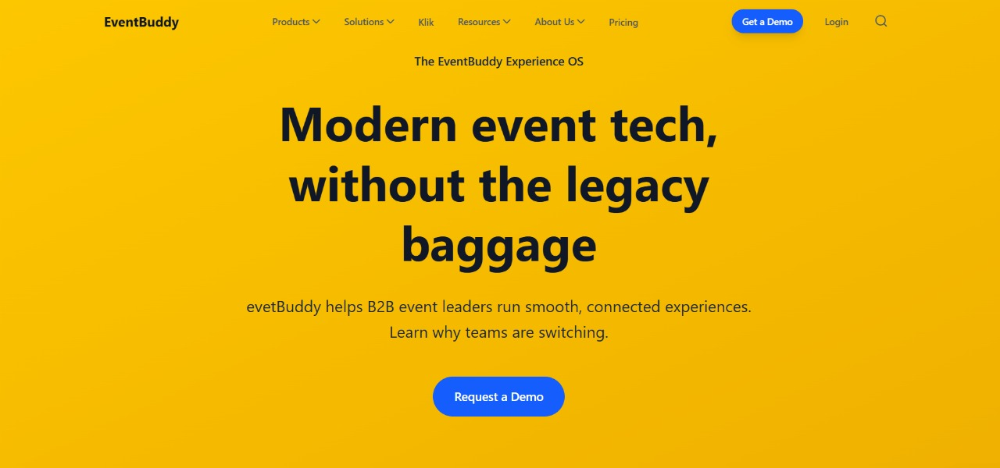
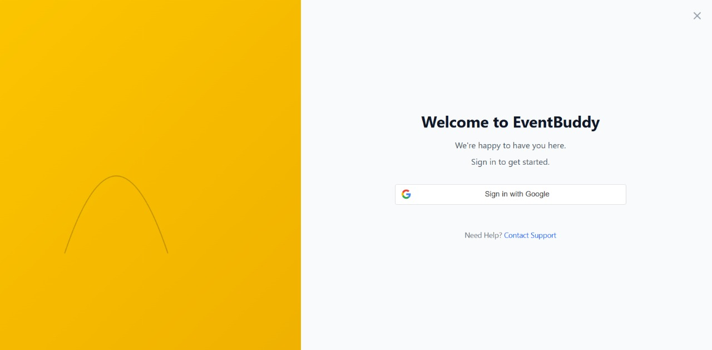
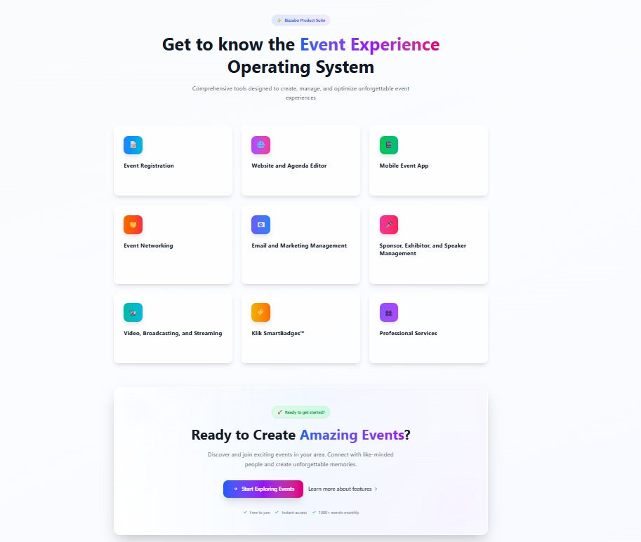
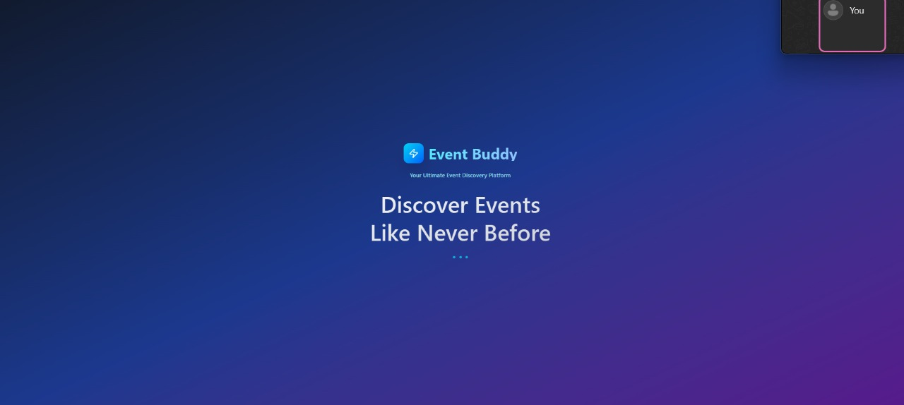
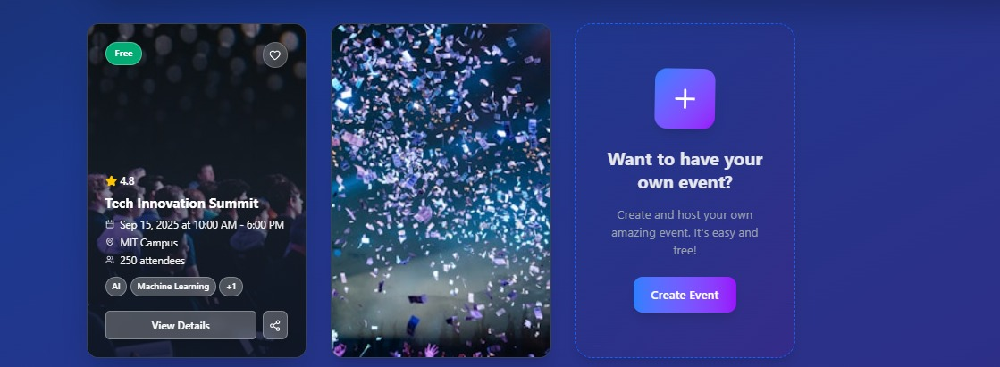
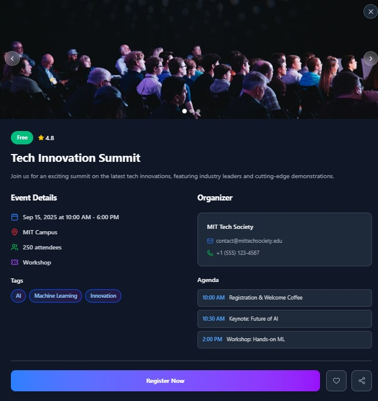
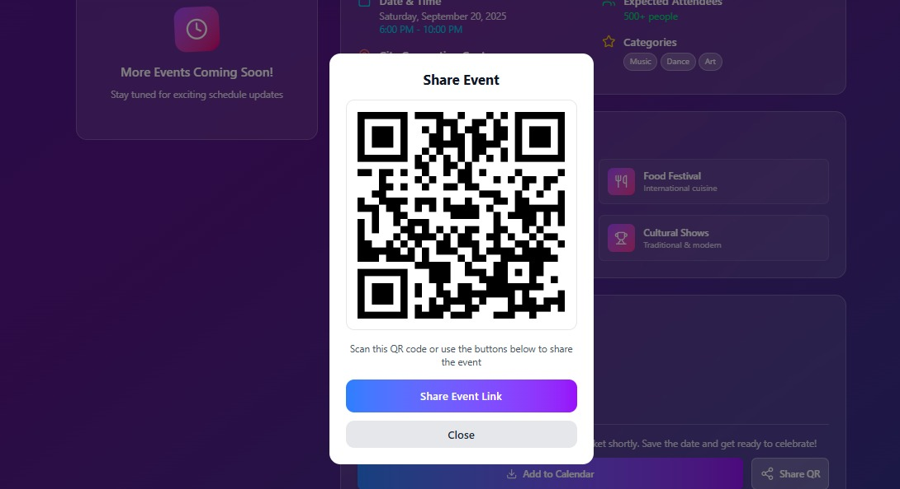
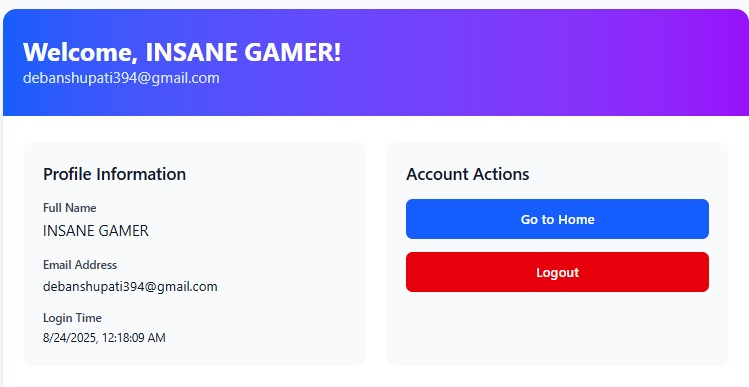

# basic auth functionality completed in backend 
# for sign_in api - http://localhost:8000/api/v1/users/auth_login
# for log_out api- http://localhost:8000/api/v1/users/auth_logout
<<<<<<< HEAD
# for fetching_details_using session cookie - http://localhost:8000/api/v1/users/auth_getprofile

# This is Landing page 

=======
# for fetching_details_using session cookie - http://localhost:8000/api/v1/users/auth_getprofile![WhatsApp Image 2025-08-24 at 00 02 21_3e9f4094]
main page

>>>>>>> 9b9cc6b563e7c172079f3bddc04e4b2fe5d83610

